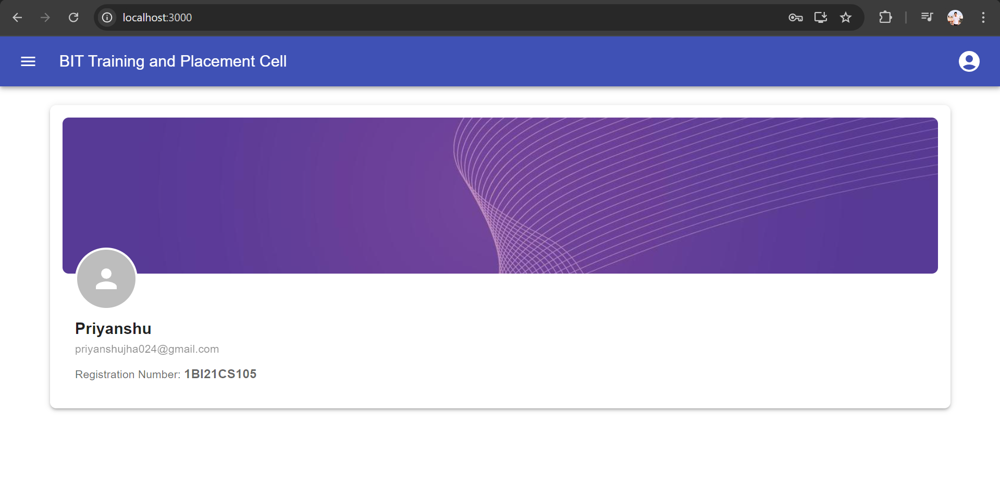
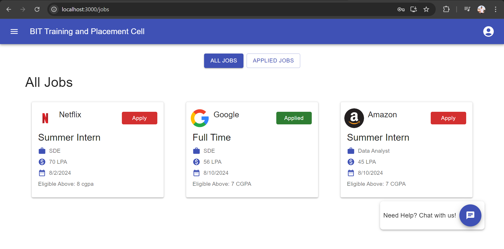
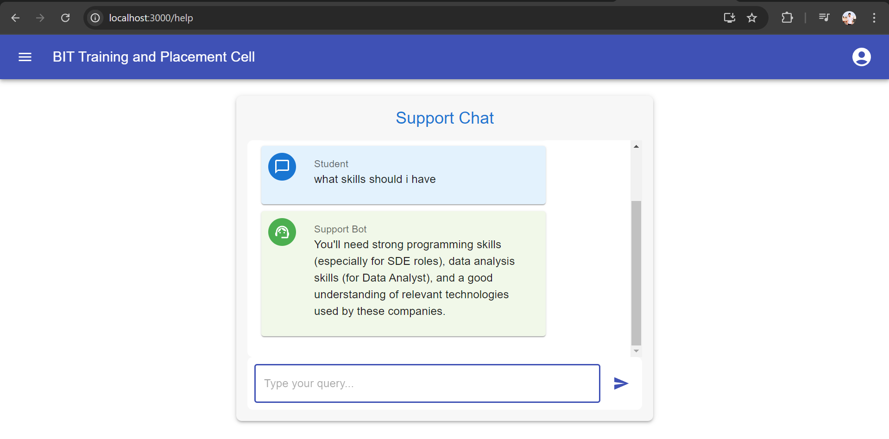
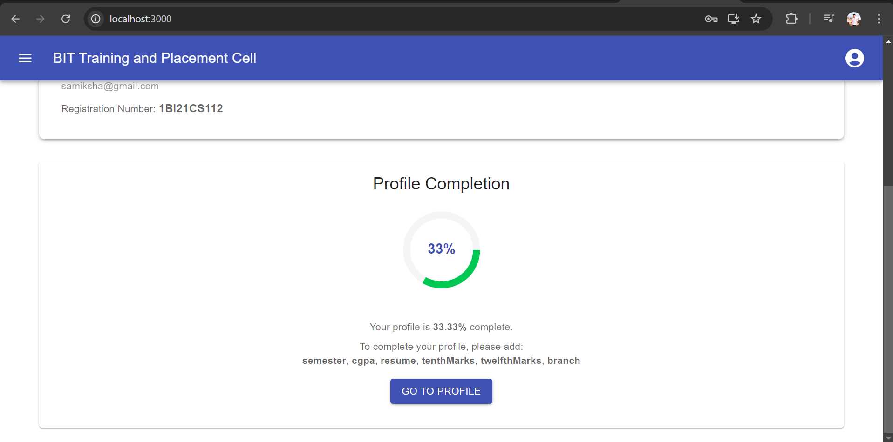
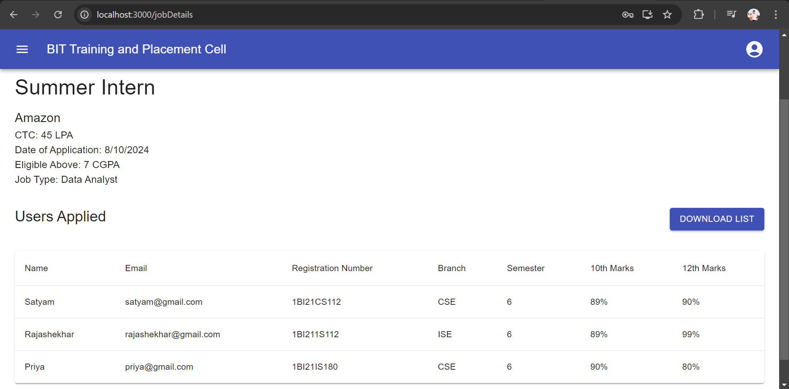
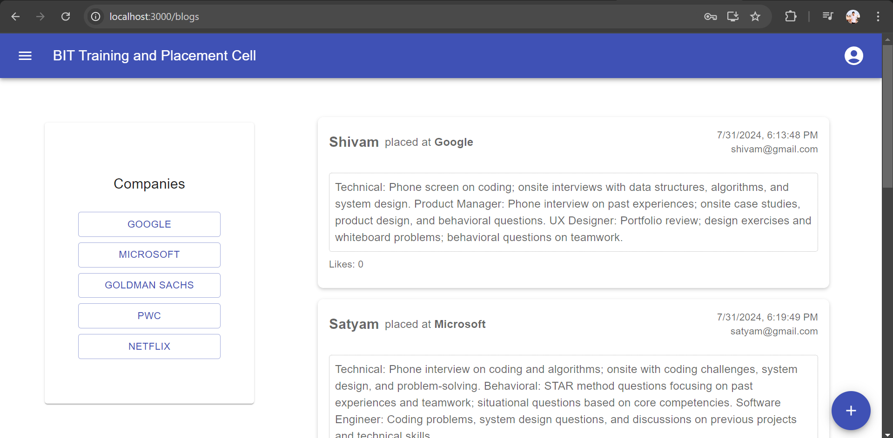
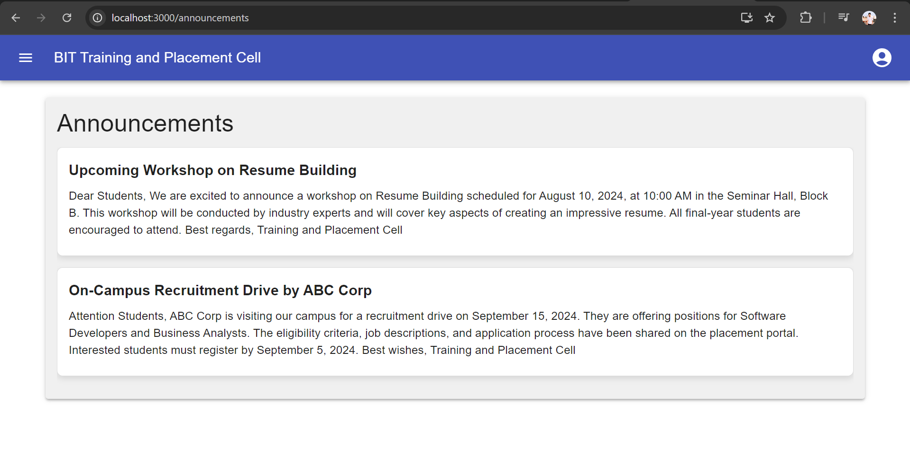

# Training and Placement Portal - Client

This repository contains the client-side code for the Training and Placement Portal, a web application built to streamline the job application process for students and provide various features for the Training and Placement Department.

## Features

- **React, Redux, Material UI**: Utilized for building a responsive and interactive UI.
- **Single Click Apply**: Enabled seamless job applications.
- **Real-Time Email Notifications**: Implemented for new job postings using NodeMailer.
- **Student Experiences**: Developed a section for students to share their experiences.
- **Upcoming Placement Announcements**: Added a section for announcements.
- **Chatbot Integration**: Integrated for instant assistance.
- **Profile Completion**: Added profile completion option for students.
- **Admin Functionality**: Admin can download Excel sheets for students applied for specific companies.

## Screenshots









## Installation

1. Clone the repository:
    ```bash
    git clone https://github.com/yourusername/training-placement-client.git
    ```
2. Install dependencies:
    ```bash
    cd training-placement-client
    npm install
    ```
3. Start the development server:
    ```bash
    npm start
    ```

## Contributing

Contributions are welcome! Please open an issue or submit a pull request.

## License

This project is licensed under the MIT License.
